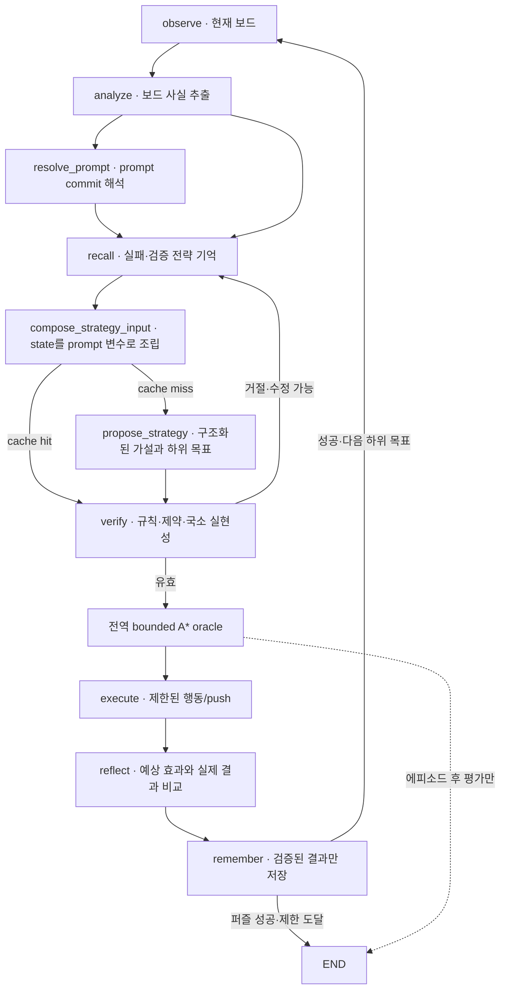

# 구조화된 문제 해결 에이전트 연구 계획

## 목적

현재 시스템은 LLM이 최대 8개의 원시 행동을 제안하고 전역 A*가 안전한
suffix를 붙이거나 전체 계획을 대체할 수 있다. 이는 실행 안정성과 LLM
prefix의 탐색 기여를 측정하는 baseline으로는 유용하지만, 에이전트가
Sokoban의 구조를 이해해 독립적으로 계획했다고 보기 어렵다.

다음 연구 단계의 목적은 처음 보는 보드에서 에이전트가 다음 과정을
관찰 가능한 산출물로 수행하는지 검증하는 것이다.

1. 보드의 상자, 목표, 통로, 구석과 push 접근 방향을 분석한다.
2. 상자-목표 배정과 push 순서에 대한 반증 가능한 가설을 세운다.
3. 보호할 칸과 피할 상태를 명시한다.
4. 한 번에 하나의 하위 목표를 선택하고 짧게 실행한다.
5. 실제 결과를 예상 효과와 비교한다.
6. 실패 원인을 관련 가설이나 하위 목표에 귀속해 수정한다.

“사람다운”이라는 표현은 인간의 숨은 사고 과정이나 심리적 동일성을
주장하지 않는다. 설명이 실제 행동을 통제하고, 새로운 구조에 일반화하며,
실패 후 국소적으로 계획을 수정하는지를 조작 가능한 상태로 측정한다.

## 연구 원칙

### 정답 oracle과 실행 정책을 분리한다

전역 bounded A*는 정답 제공자가 아니라 평가 seam 뒤의 oracle Adapter다.
주 정책 실행 중에는 전체 행동열, 정답 suffix와 정답에서 유도한 상자-목표
배정을 제공하지 않는다. 에피소드가 끝난 뒤 해결 가능 여부, 행동·push
overhead와 탐색량을 비교하는 데만 사용한다.

### 도구는 전략을 대신하지 않는다

다음 결정론적 도구는 허용한다.

- 게임 규칙에 따른 한 행동의 합법성·성공·명백한 데드락 판정
- 상자를 고정한 플레이어 도달 가능 영역과 국소 이동 경로
- 에이전트가 선택한 단일 push 또는 위치 하위 목표의 실현 가능성
- 정적 dead square와 목표별 reverse-pull 거리 같은 보드 사실

도구는 후보 사실과 검증 결과를 반환하며 다음 상자, 목표 또는 장기 push
순서를 선택하지 않는다. 각 호출의 입력, 결과와 비용을 기록한다.

### 설명을 실행 가능한 상태로 만든다

자연어 `goal`, `decision_summary`, `risk`만으로 계획을 표현하지 않는다.
계획 산출물의 필드가 검증, 실행, 성찰과 평가에서 실제로 소비되어야 한다.
자연어는 사용자에게 요약을 보여주는 보조 표현으로 유지한다.

### 짧게 실행하고 다시 관찰한다

하나의 하위 목표에 필요한 제한된 행동 또는 한 번의 push만 실행한다.
실행 뒤 보드를 다시 분석하고 예상 효과, 보호 제약과 실패 조건을 판정한다.
긴 행동열을 처음부터 끝까지 믿고 실행하지 않는다.

### LangGraph와 LangSmith를 우선 사용한다

상태 전이, 반복, 재시도, checkpoint, resume와 관찰 구조를 자체 framework로
다시 만들지 않는다. LangGraph의 `StateGraph`, state reducer, conditional
edge, `Command`, subgraph, retry policy와 checkpointer를 우선 사용한다.
도메인 코드는 Sokoban 분석·검증·실행 node의 순수한 Implementation에
한정한다.

프롬프트의 실행 수명 주기는 LangGraph가 소유한다. prompt 선택·입력 조립과
모델 호출을 node로 드러내고, 본문·commit·환경 tag는 LangSmith Prompt
Management를 우선 사용한다. 자체 prompt registry, version store, cache와
승격 체계는 만들지 않는다.

- 연구 실행은 mutable tag가 아니라 prompt commit을 고정한다.
- 개발·운영은 필요할 때 `staging`·`production` tag를 사용할 수 있다.
- graph state와 결과에는 prompt 이름, resolved commit, 모델 설정과 입력
  변수의 안전한 요약을 남긴다.
- 전체 prompt나 숨은 추론 원문을 checkpoint에 중복 저장하지 않는다.
- 네트워크가 없는 단위 테스트는 고정된 prompt fixture로 같은 node
  Interface를 시험한다.

## 주 구조화 LangGraph



### 계획 산출물 Module

계획 산출물 Module은 그래프, Planner Adapter와 평가 코드가 공유하는
Interface를 제공한다. 첫 구현에서 최소한 다음 개념을 표현한다.

- `BoardAnalysis`: 상자·목표 ID, dead square, 통로와 가능한 push 방향
- `StrategyHypothesis`: 상자-목표 배정, 순서 가설과 간결한 근거
- `ProtectedConstraint`: 점유하거나 막으면 안 되는 칸 또는 상태
- `Subgoal`: 대상 상자, 의도한 push나 플레이어 위치, 선행 조건
- `ExpectedEffect`: 실행 뒤 반드시 관찰되어야 하는 상태 변화
- `FailureCondition`: 가설이나 하위 목표를 폐기·수정하는 조건
- `PlanRevision`: 유지·수정·철회된 필드와 관찰 근거

환경과 solver의 상자는 위치 집합으로 계속 표현하되, 계획 산출물에는 최초
위치와 push 이력을 기준으로 갱신되는 안정적인 논리 ID를 둔다. 타입 이름은
구현 과정에서 조정할 수 있지만 위 의미와 불변 조건은 Interface에 남겨야
한다. 모델 JSON, 규칙 기반 fixture와 향후 다른 Planner는 같은 Interface를
만족하는 Adapter가 된다.

### 보드 분석 Module

보드 분석 Module은 모델과 그래프가 중복해서 공간 사실을 계산하지 않도록
한다. 한 관찰을 입력받아 안정적인 ID와 결정론적 사실을 반환하는 깊은
Module로 만든다. 구현 세부에는 flood fill, reverse-pull 거리와 정적 dead
square 계산을 둘 수 있지만 호출자는 알고리즘 순서를 알 필요가 없다.

### 전략 Planner Module

전략 Planner는 `BoardAnalysis`, 최근 push, 실행 결과와 거절 피드백을 받아
다음 안전한 `push_id`와 목표를 작은 decision으로 제안한다. 원시 행동이나
전체 `StrategyHypothesis`를 매번 직접 생성하지 않는다. Adapter가 현재 보드
사실에서 목적지, 예상 효과와 실패 조건을 결정론적으로 채워 기존 계획
Interface로 합성한다. 첫 Adapter는 구조화된 LLM 응답이고, 테스트와
ablation을 위한 규칙 기반 Adapter를 함께 둬 seam을 실제로 만든다.

### 계획 검증 Module

계획 검증 Module은 다음을 판정한다.

- 참조한 상자·목표·칸이 현재 보드에 존재하는가?
- 하위 목표가 현재 전략 가설과 모순되지 않는가?
- 보호 제약을 즉시 위반하지 않는가?
- 의도한 push의 지지 칸과 목적지가 유효한가?
- 국소 도달성 도구로 실현 가능한가?

검증기는 전략을 고쳐 쓰거나 전역 정답으로 대체하지 않는다. 실패 코드와
구조화된 근거를 반환해 Planner가 수정하게 한다.

### 국소 실행 Module

국소 실행 Module은 검증된 하위 목표 하나를 원시 행동으로 접지한다.
상자를 움직이지 않는 플레이어 이동이나 명시된 단일 push까지의 경로만
계산한다. 전체 퍼즐 성공 상태를 목표로 탐색하지 않는다.

### 하나의 graph 정의와 Studio

별도 공통 graph kernel이나 Studio 전용 workflow를 만들지 않는다.
`StateGraph` 하나가 state, node, edge, reducer와 retry policy를 정의하고,
Agent Server·Studio는 composition root의 compiled graph를, CLI·평가는 같은
factory로 local compile한 graph를 사용한다. `langgraph.json`도 이 composition
root를 직접 가리킨다.

계획 수립처럼 내부 상태 수명이 분명한 반복만 LangGraph subgraph로
구성한다. local 실행은 `InMemorySaver`, Agent Server에서는 제공되는
persistence를 사용한다. Studio 표시 때문에 별도 실행 경로를 만들지 않고,
state를 JSON-safe하게 유지해 checkpoint와 subgraph 상태를 직접 검사한다.

실패 push와 최근 수정은 checkpointer의 thread state에 유지한다. 검증된
전략·접지 경로와 topology-only 분석은 graph에 주입한 LangGraph Store에
정확 일치 키로 보존한다. Store 적중도 `verify_strategy`와 규칙 기반 접지
재검증을 건너뛰지 않으며, 환경에서 예상 효과가 확인된 결과만 공유한다.
held-out 정책 비교는 공유 메모리를 끄고 cache 요청·적중·절감 호출을 별도
계측한다.

### prompt와 모델 node

프롬프트는 `LLMPlanner._build_prompt()` 같은 Adapter 내부 구현에 숨기지
않는다. LangGraph에서 다음 수명 주기를 관찰할 수 있게 한다.

```text
resolve_prompt → compose_strategy_input → propose_strategy → verify_strategy
```

- `resolve_prompt`: 고정 commit 또는 환경 tag를 LangSmith에서 해석
- `compose_strategy_input`: 현재 `BoardAnalysis`, 이전 revision과 feedback을
  prompt 변수로 구성
- `propose_strategy`: 모델을 호출해 구조화된 계획 산출물 생성
- `verify_strategy`: schema를 통과한 의미를 도메인 규칙으로 검증

transient한 prompt/model 전송 실패는 LangGraph retry policy로 처리하고,
schema·의미 오류는 state update와 conditional edge로 수정 경로에 보낸다.
prompt commit과 모델 설정은 runtime context로 주입하고 실행 결과에 고정해
재현성을 보장한다.

### 성찰과 trace Module

성찰 Module은 실행 전후 상태와 `ExpectedEffect`, `FailureCondition`을
비교한다. 결과는 성공, 실행 실패, 가설 반증, 제약 위반, 예상 밖 변화로
구조화한다. 자연어 회고는 이 판정에서 파생한다.

행동 결정과 계측 필드를 하나의 넓은 결과 객체에 계속 추가하지 않고,
구조화된 decision·revision event를 trace Module에 누적한다. 새 연구 지표를
추가할 때 graph, runtime과 결과 타입을 동시에 수정하는 비용을 줄인다.

## 상태와 체크포인트

LangGraph 상태에는 기존 관찰·행동·비용 지표에 다음을 추가한다.

- 현재 `BoardAnalysis`
- 활성 `StrategyHypothesis`
- 현재 및 완료된 `Subgoal`
- 활성 `ProtectedConstraint`
- 직전 `ExpectedEffect`와 구조화된 실행 결과
- `PlanRevision` 이력
- 같은 분석·가설·하위 목표 반복을 탐지하는 안정적인 키
- 규칙·도달성·국소 탐색 도구 호출과 비용

전체 프롬프트나 숨은 추론 원문은 연구 상태에 저장하지 않는다. 모델의
구조화된 결정과 검증 가능한 짧은 근거만 남긴다.

## 평가 설계

### 비교 정책

최소한 다음 정책을 동일한 그래프 실행 규칙으로 비교한다.

1. `primitive-llm`: 현재처럼 원시 방향 행동을 생성하며 전역 guard는 없음
2. `structured-llm`: 구조화된 가설과 하위 목표만 사용
3. `structured-local-search`: 구조화된 계획과 국소 실행 도구 사용
4. `structured-no-rationale`: 구조화된 필드는 사용하되 자연어 근거 제거
5. `current-full-guard`: 현재 LLM+A* 전체 대체 baseline
6. `astar-oracle`: 실행 외부의 bounded A* 비교 기준

`current-full-guard`의 성공률은 시스템 상한 비교에 사용할 수 있지만
에이전트 독립 해결 성공률에 합산하지 않는다.

### 레벨 분할

레벨 ID만 무작위로 나누지 않고 구조적 일반화를 드러내는 코호트를 만든다.

- 동일 크기·상자 수의 새로운 배치
- 학습·개발보다 큰 보드
- 더 많은 상자와 목표
- 방, 좁은 통로, 터널 구조의 변화
- 먼저 목표에서 상자를 빼야 하거나 자연스러운 첫 push가 함정인 레벨
- 해결 불가능하거나 탐색 한도 안에서 미확정인 레벨

외부 데이터는 커밋, 체크섬, split과 레벨 ID를 manifest로 고정한다.
프롬프트와 예제에서 test 레벨 및 oracle 경로를 제외한다. bounded A*가
한도 안에서 실패한 사례는 “해답 없음”이 아니라 “oracle 미해결”로 기록한다.

### 핵심 지표

- 퍼즐 성공률과 제한 도달률
- 행동 수, push 수와 bounded A* 대비 overhead
- 전략 가설·상자-목표 배정·하위 목표의 유지와 수정 횟수
- 하위 목표 시도·성공·실패율
- 보호 제약 위반과 데드락 진입률
- 같은 상태·가설·하위 목표의 반복률
- 예상 효과와 실제 상태 변화의 일치율
- 실행 행동이 선언한 하위 목표에서 유도되는 비율
- 규칙·도달성·국소 탐색 도구 호출, 확장 상태와 시간
- LLM 호출, 토큰, 지연 시간과 전체 정책 시간
- 구조별 held-out 성능과 seed 간 분산

설명-행동 일치는 문자열 유사도가 아니라 계획 필드를 조작하거나 제거하는
ablation에서 행동과 성능이 달라지는지로 확인한다.

## 구현 단계와 완료 이력

### 1. 연구 계약 고정

- 계획 산출물 타입, 안정적인 상자 ID 규칙과 JSON fixture를 정의한다.
- 전역 oracle, 허용된 국소 도구와 금지된 정보 누출을 테스트로 고정한다.
- 현재 baseline의 지표 이름과 결과 형식을 보존한다.

완료 조건: 정상·모순·누락 계획 fixture의 직렬화와 검증 테스트가 통과하고,
주 정책이 전역 A* 결과를 참조하지 않는 테스트가 존재한다.

### 2. 보드 분석

- 상자와 목표에 관찰마다 안정적인 ID를 부여한다.
- 가능한 push 방향, 플레이어 도달 영역, dead square와 reverse-pull 사실을
  계산한다.
- Studio에서 분석 결과를 확인한다.

완료 조건: 회전·통로·구석·복수 상자 fixture에서 분석 결과가 결정론적이고,
환경 규칙과 모순되지 않는다.

### 3. prompt 수명 주기와 구조화된 전략 Planner

- LangSmith에 연구용 prompt를 만들고 실험에서는 commit을 고정한다.
- prompt 해석·입력 조립·모델 호출을 관찰 가능한 LangGraph node로 분리한다.
- LLM 응답 schema를 원시 행동에서 계획 산출물로 전환한다.
- 규칙 기반 fixture Planner Adapter를 추가한다.
- 존재하지 않는 대상, 모순된 배정과 제약을 거절한다.

완료 조건: 모델 없이도 전체 그래프의 계획·거절·수정 경로를 결정론적으로
시험할 수 있고, 형식 오류가 구조화된 피드백으로 돌아간다. 결과에 prompt
commit이 기록되고 같은 commit·입력·seed로 실행을 재현할 수 있다.

### 4. 하위 목표 검증과 국소 실행

- 단일 push와 플레이어 위치 하위 목표를 먼저 지원한다.
- 검증된 하위 목표를 제한된 원시 행동으로 접지한다.
- 전역 성공 상태를 목표로 탐색하는 호출을 차단한다.

완료 조건: 세부 이동이 필요한 하위 목표를 실행하고, 불가능하거나 보호
제약을 위반하는 하위 목표는 환경 전이 전에 거절한다. 전역 A*를 실패하도록
대체한 테스트에서도 국소 실행이 독립적으로 통과한다.

### 5. 단일 StateGraph와 관찰·성찰 루프

- 현재 일반 실행과 Studio의 중복 routing을 하나의 `StateGraph`로 통합한다.
- 누적 decision·revision trace에는 LangGraph state reducer를 사용한다.
- transient 오류에는 node retry policy를 적용한다.
- 실행 후 예상 효과와 실제 상태를 비교한다.
- 성공한 하위 목표를 완료하고 다음 계획으로 이동한다.
- 반증된 가설과 반복 계획을 기록해 국소 수정한다.

완료 조건: 의도적 실패 fixture에서 전체 에피소드를 초기화하지 않고 관련
하위 목표 또는 가설을 수정하며, 같은 실패의 무한 반복을 종료한다.
CLI·평가·Studio가 동일한 compiled graph와 checkpoint state를 사용한다.

### 6. 일반화 실험

- 구조별 manifest와 비교 정책 runner를 추가한다.
- 기존 전역 A* 계측을 실행 외부 oracle로 재사용한다.
- ablation 표와 trajectory를 재현 가능한 노트북으로 만든다.

완료 조건: 고정 개발·test 코호트에서 모든 정책이 동일한 사례를 실행하고,
성공·비용·하위 목표·설명-행동 기여 지표를 함께 보고한다.

소형 구조 fixture인 `agentic_heldout_v1`과 Boxoban 공식 난이도별
`boxoban_research_v1` manifest, 6정책 runner가 구현되어 있다.
`structured-llm`은 현재 지지 칸에서 가능한 push만 직접 실행하고,
`structured-local-search`만 지지 칸 경로를 탐색하므로 국소 도구의 기여를
분리한다. 실행 manifest는 immutable prompt commit, graph revision, 모델
설정과 seed를 고정한다. 노트북은 정확한 action sequence를 trajectory로
재구성하고 rationale 제거 개입 전후 행동 변화를 비교한다.

### 7. 이후 확장

구조화된 상태 기반 에이전트가 안정된 뒤 다음을 별도 실험으로 추가한다.

- 화면 기반 perception과 인식 불확실성
- 더 강한 동적 데드락 분석
- 학습된 전략·가치 모델 또는 자동 curriculum

perception을 추가할 때는 기존 구조화 상태 정책의 성능을 먼저 고정해 계획
오류와 관찰 오류를 섞지 않는다. 실패·전략·접지 memory는 LangGraph Store
기반으로 구현됐으며 연구 실행에서는 `memory_mode=off`로 정보 누설을 막는다.

## 기술 참고

- [LangGraph Graph API](https://docs.langchain.com/oss/python/langgraph/graph-api)
- [LangGraph subgraph](https://docs.langchain.com/oss/python/langgraph/use-subgraphs)
- [LangGraph persistence](https://docs.langchain.com/oss/python/langgraph/persistence)
- [LangSmith prompt 관리](https://docs.langchain.com/langsmith/manage-prompts)
