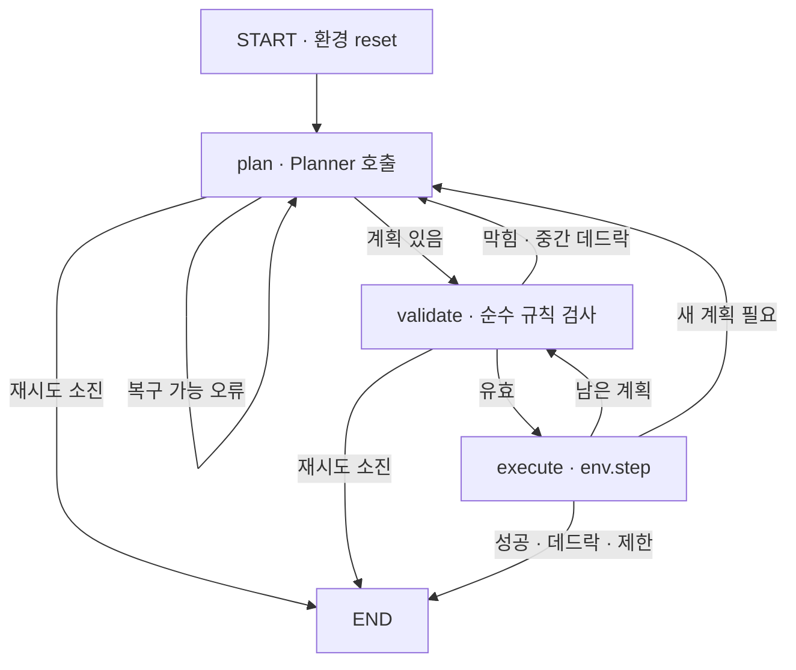
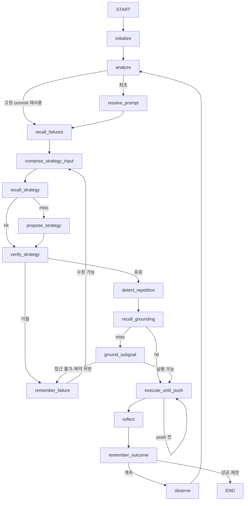

# LangGraph 중심 아키텍처

이 프로젝트의 실행 코어는 LangGraph다. Gymnasium 환경은 게임 규칙과 상태
전이의 단일 기준이고, Planner는 상태를 직접 변경하지 않은 채 행동 계획만
제안한다.

현재 그래프는 원시 행동 Planner와 전역 탐색 guard를 비교하기 위해 구현한
baseline이다. 목표 아키텍처도 별도 자체 실행기를 만들지 않고 LangGraph의
`StateGraph`, state reducer, conditional edge, `Command`, subgraph와
checkpointer를 우선 사용한다. 자체 코드는 Sokoban 도메인 타입과 각 노드의
순수한 Implementation에 한정한다.

전환 원칙과 단계별 완료 조건은
[구조화된 문제 해결 에이전트 연구 계획](AGENTIC_PLANNING.md)에 정의한다.

## 현재 baseline 실행 그래프

`SokobanGraphState`에는 관찰, 환경 정보, 남은 계획, 행동 이력, 거절 피드백,
계획 시도 횟수와 평가 지표가 들어간다. `InMemorySaver`는 에피소드
`thread_id`별로 각 노드 이후 상태를 체크포인트한다.

## Planner 경계

모든 계획 방식은 같은 `Planner` Protocol을 구현한다.

- `RandomPlanner`: 한 행동을 표본 추출한다.
- `BFSPlanner`: 현재 상태에서 완전한 최단 행동열을 계산한다.
- `AStarPlanner`: 플레이어 이동 가능 영역을 계산하고 상자 밀기 단위로
  탐색한다. 상자-목표 최소 매칭과 정적 dead square를 휴리스틱으로 사용한다.
- `LLMPlanner`: JSON Schema로 1~8개의 짧은 행동 계획을 제안한다.
- `SearchGuardPlanner`: 주 Planner의 전체 제안을 규칙으로 적용한 뒤 BFS
  또는 A*로 후속 해답을 확인한다. 찾은 경로는 버리지 않고 제안 뒤에
  연결하며 같은 보드의 탐색 결과는 에피소드 동안 캐시한다.

그래프는 Planner 종류를 알 필요가 없다. 알고리즘 Planner가 여러 행동을
반환하면 그래프가 전체 계획의 막힌 이동과 중간 데드락을 먼저 검사하고
순서대로 실행한다. LLM의 형식 오류나 거절된 계획은 상태의 feedback에
기록되고 `plan` 노드로 되돌아간다.

현재 `Planner` Interface는 원시 `actions`를 중심으로 설계되어 있다.
`goal`, `decision_summary`, `risk`는 실행 불변 조건이 아니라 표시와 진단을
위한 문자열이다. `SearchGuardPlanner`가 전역 해답을 suffix로 연결하거나
전체 대체할 수 있으므로 이 Interface는 새 연구에서 baseline Adapter로
보존하되 주 에이전트의 전략 Interface로 확장하지 않는다.

## 목표 LangGraph

이 흐름은 Python 루프로 감싼 자체 workflow가 아니라 하나의 컴파일된
`StateGraph`로 표현한다.

- State schema는 관찰, 보드 분석, 활성 가설, 하위 목표, 예상 효과와
  계측 event를 소유한다.
- 노드는 필요한 state update만 반환하고, 누적 trace는 reducer로 합친다.
- 고정 전이는 normal edge, 상태에 따른 전이는 conditional edge를 사용한다.
- 한 노드가 update와 routing을 함께 결정해야 할 때만 `Command`를 사용한다.
- LLM 전송 오류에는 LangGraph retry policy를 사용하고, 형식·의미 오류는
  state에 구조화해 edge로 수정 경로에 보낸다.
- 전략 수립처럼 내부 상태 수명이 분명한 반복만 subgraph 후보로 두며,
  단순히 파일을 나누기 위해 subgraph를 만들지 않는다.
- local 실행은 `InMemorySaver`, Agent Server는 제공되는 persistence를
  사용한다. 별도 체크포인트 저장 계층을 만들지 않는다.
- `thread_id`와 checkpoint history로 실패 직전 상태를 재현하고, Studio에서
  같은 컴파일된 그래프를 직접 검사한다.

일반 실행과 Studio용 노드·routing을 별도로 유지하지 않는다.
`langgraph.json`은 주 그래프 하나를 가리키고, CLI·평가·Studio가 같은
compiled graph를 호출한다. JSON-safe 표시 변환이 필요하면 state 또는
노드의 얇은 Adapter로 제한한다.

## 계획 상태와 도메인 노드

목표 그래프의 중심은 원시 행동열이 아니라 구조화된 계획 상태다.
`BoardAnalysis`, `StrategyHypothesis`, `ProtectedConstraint`, `Subgoal`,
`ExpectedEffect`, `FailureCondition`, `PlanRevision`을 state에 명시한다.

LangGraph가 구조 정책과 수명 주기를 소유하고, 도메인 Module은 다음
Implementation만 제공한다.

- `analyze`: 보드의 결정론적 사실 추출
- `resolve_prompt`: 고정된 LangSmith prompt commit을 해석
- `compose_strategy_input`: graph state를 prompt 변수로 조립
- `propose_strategy`: 작은 push decision을 받아 완전한 전략 artifact로 합성
- `verify_strategy`: 참조·제약·국소 실현성 검증
- `ground_subgoal`: 선택된 한 하위 목표를 제한된 행동으로 접지
- `execute_until_push`: 최대 한 번의 push까지만 환경 전이
- `reflect`: 예상 효과와 실제 상태를 비교해 revision event 생성

전역 A*는 이 StateGraph에 node나 tool로 연결하지 않는다. 에피소드 종료 후
평가 Module이 별도의 oracle Adapter로 호출한다.

## LangGraph 메모리

thread 단기 기억은 checkpointer가 저장하는 graph state가 소유한다.
`rejected_pushes`는 현재 보드 추상화에서 검증·접지에 실패한 push를 기록하고,
`compose_strategy_input`이 다음 모델 호출 전에 해당 후보를 제거한다.

공유 기억은 graph에 주입한 LangGraph Store가 소유한다.

- `analyze`는 topology checksum으로 정적 dead square와 reverse-pull 사실을
  재사용한다.
- `recall_strategy`는 prompt commit, model, rationale·grounding mode와 정확한
  전략 입력이 모두 같은 경우에만 검증된 전략을 복원한다.
- `recall_grounding`은 observation, 하위 목표와 보호 제약이 정확히 같은
  경로를 복원하고, 원시 행동을 선형 시뮬레이션해 다시 검증한다.
- `remember_outcome`은 실제 환경 효과가 일치한 전략과 경로만 Store에 쓴다.
- `remember_failure`은 실패 push와 구조화된 이유를 단기 state와 선택적인
  공유 Store에 남긴다.

`memory_mode`는 `off`, `episode`, `shared`로 구분한다. held-out 연구 runner는
정책 간 정보 누설을 막기 위해 `off`를 명시한다. 요청·적중·쓰기, 전략·접지·
분석 cache hit, 절감한 LLM 호출과 필터링한 push 수를 각각 계측한다.

## prompt 관리

LangGraph는 prompt의 실행 수명 주기를 소유한다. prompt 선택, state에서
입력 변수를 구성하는 과정, 모델 호출, schema 오류와 재시도를 각각 graph
node와 state transition으로 드러낸다. prompt 본문과 버전은 LangSmith
Prompt Management를 우선 사용한다.

- 연구 결과는 mutable tag 대신 resolved prompt commit을 기록한다.
- 개발·운영 승격이 필요할 때 LangSmith의 `staging`·`production` tag를
  사용한다.
- prompt 이름·commit과 모델 설정은 runtime context로 주입하고 결과
  manifest에 보존한다.
- transient한 pull·모델 오류는 node retry policy로 처리한다.
- schema·의미 오류는 예외 재시도가 아니라 state update와 conditional
  edge로 전략 수정 경로에 보낸다.
- 모델에는 현재 안전한 push 후보와 bounded recent pushes만 전달하고,
  목적지·예상 효과·실패 조건은 도메인 Adapter가 결정론적으로 채운다.
- 자체 prompt registry, version database, cache와 배포 workflow를 만들지
  않는다.
- offline 단위 테스트는 고정 fixture를 사용하되 같은 node Interface와
  state transition을 검증한다.

전체 prompt 본문과 숨은 추론 원문은 checkpoint에 중복 저장하지 않는다.
재현에 필요한 prompt commit과 안전한 입력 변수만 보존한다.

## 책임 경계

- `env/`: 레벨, 규칙, 상태 전이, 성공과 데드락 판정
- `planning/`: baseline Planner, 전략 schema·Adapter와 국소 도메인 도구
- `graph/`: LangGraph state, node, edge, subgraph와 graph factory
- `evaluation/`: 동일한 그래프를 사용한 벤치마크, 집계, trajectory

평가 실행기는 별도 행동 루프를 구현하지 않는다. 반드시 `SokobanGraph`를
호출하므로 기준선과 LLM이 같은 검증·복구 정책을 통과한다. 새 그래프가
도입되면 Python wrapper는 Agent Server assistant context와 JSON 입력을
compiled graph에 전달하는 역할만 한다. 환경 객체는 context나 checkpoint에
넣지 않고 관찰·실행 결과만 graph state에 보존한다.

구조화 정책은 `build_agentic_graph()` 한 곳에서만 node와 edge를 정의한다.
Agent Server·Studio는 `langgraph.json`의 compiled graph를 사용하고, CLI와
평가는 `AgenticGraphRunner`가 같은 factory를 local `InMemorySaver`와 함께
호출한다. 실행기는 행동·재계획 루프를 구현하지 않으며 최종 graph state의
계측만 결과 계약으로 투영한다. 원시 행동 baseline의 기존 graph는 비교
정책을 재현하기 위해서만 유지한다.

## 측정

에피소드 결과는 전체·계획·LLM·알고리즘 시간을 분리한다. 모델 계측은
ChatLiteLLM이 제공하는 LangChain 표준 usage metadata의 입출력 토큰 수를
보존하고 탐색은 확장 상태 수와 순수 탐색 시간을 기록한다. provider 고유
시간 필드는 공통 계약을 위해 유지하되 metadata에 없으면 0으로 둔다.
집계에는 평균뿐 아니라 p50, p95와 출력 tokens/s가 포함된다.

LLM 기여도 실험에서는 정책이 실제 사용한 탐색과 진단용 탐색을 분리한다.
`guard_suffix_expanded_states`는 LLM prefix 이후 suffix 탐색량,
`guard_reference_expanded_states`는 같은 초기 상태를 다시 푼 bounded A*
비교값이다. 둘의 차이는 `guard_expansions_saved`로 기록한다. 진단용
reference 시간은 `policy_elapsed_seconds`에서 제외한다.
탐색 계측은 cache hit도 포함한 `algorithm_requests`, 실제 solver 실행인
`algorithm_calls`, `algorithm_cache_hits`, `algorithm_failures`를 분리한다.

구조화 연구 정책은 `rule_checks`, `reachability_calls`,
`local_search_calls`, `local_expanded_states`,
`local_search_elapsed_seconds`를 별도로 기록한다. 하위 목표 접지 시도·실패,
예상 효과 일치·불일치와 실행 행동 sequence도 결과 계약에 포함한다.
평가 runner는 원시 행동 LLM, direct 구조화, 국소 탐색 구조화, rationale
제거, full guard와 외부 A* oracle을 동일한 level·seed grid에 투영한다.
이 비교 runner는 정책 루프를 다시 구현하지 않고 구조화 정책에는
`AgenticGraphRunner`, baseline에는 기존 `SokobanGraph`를 호출한다.

`guard_disposition`은 `accepted`, `suffix_added`, `replaced`, `failed` 중
하나이며 제안 행동 수, 합법 prefix 수, 실제 채택 수를 함께 남긴다. 그래프
실행 중 정확히 같은 보드로 돌아오면 `revisited_states`, 같은 상태에서 같은
계획을 다시 제안하면 `repeated_plans`가 증가한다. 에피소드 시작점의 별도
bounded A* reference는 성공한 정책의 행동 수와 push 수 overhead를 비교하는
기준이다.

## LangGraph Studio

Studio 전용 그래프는 실행 단계를 다음 노드로 분리해 표시한다.

`initialize → llm_plan → astar_guard → validate_plan → execute_action`

그래프 노드와 상태 필드 같은 기술 식별자는 영어를 사용한다. 상태에는
보드와 행동뿐 아니라 한국어로 생성된 `goal`, `decision_summary`, `risk`,
`guard_summary`와 단계별 `decision_log`가 들어간다. 현재 이 자연어 필드는
표시와 진단용이며 실제 실행 제약은 아니다. 이는 모델의 숨은
chain-of-thought를 노출하는 기능도 아니다. 로컬 Agent Server가 그래프
상태와 노드 전이를 Studio에 전달하며 기본 설정에서는 LangSmith 원격
추적을 끈다.

목표 그래프에서는 별도 Studio 전용 workflow를 만들지 않는다. Studio가
주 `StateGraph`의 `BoardAnalysis`, 활성 가설, 현재 하위 목표, 보호 제약,
예상 효과, 검증 결과와 revision history를 checkpoint별로 직접 표시한다.

## 다음 확장

실제 LangSmith prompt commit으로 Agent Server·viewer·held-out 실험을
종단간 검증한 뒤, 장기 기억은 LangGraph Store를 우선 검토하고 관련 실패
가설과 전략을 검색하는 `recall` node로 연결한다. 화면 기반 perception,
더 강한 freeze/tunnel deadlock과 학습된 전략 모델은 계획 성능을
독립적으로 측정한 뒤 추가한다.
