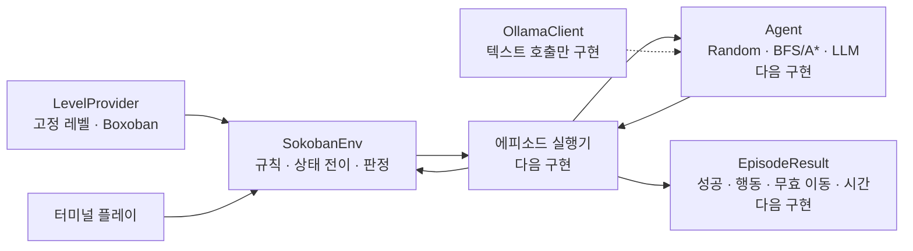

# 아키텍처

이 프로젝트는 Gymnasium 환경을 게임 규칙의 단일 기준으로 사용한다.
터미널 사용자와 향후 모든 에이전트는 같은 `reset()`과 `step()` 계약을
통해 보드를 조작한다.

## 최소 실행 구조

## 구현된 경계

- `LevelProvider`는 같은 크기의 레벨을 ID 또는 seed 기반 표본으로 공급한다.
- `SokobanEnv`만 플레이어와 상자 위치를 변경한다. 외부 코드는 항상
  `step()`으로 행동을 실행한다.
- 승리와 정적 코너 데드락은 `terminated`, 행동 제한 도달은 `truncated`로
  구분한다.
- 터미널 플레이는 환경을 조작하는 UI일 뿐 별도 게임 규칙을 갖지 않는다.
- `OllamaClient`는 텍스트 호출만 담당하며 아직 Agent 계약을 구현하지 않는다.

## 다음 최소 구조

다음 단계에서는 세 가지 계약만 추가한다.

1. `Agent`: 관찰과 실행 정보를 받아 다음 행동을 반환한다.
2. 에피소드 실행기: reset, Agent 호출, step, 종료와 행동 제한을 관리한다.
3. `EpisodeResult`: 성공, 행동 수, 무효 이동, 데드락과 시간을 기록한다.

상태 분석기, Planner, Controller 같은 세부 계층은 실제 구현 사이에 서로
다른 책임이 확인될 때 추가한다. 우선순위와 완료 조건은
[TODO](../TODO.md)에서 관리한다.
