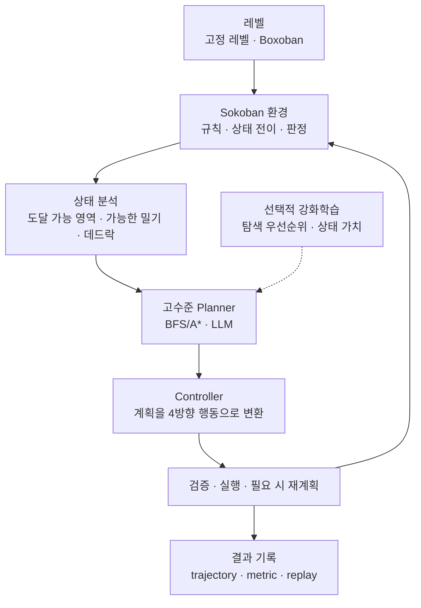

# 아키텍처

이 프로젝트는 오픈소스 Gymnasium 위에 Sokoban 환경을 구현하고, 모든
에이전트가 같은 환경과 지표를 사용하도록 구성한다.

## 핵심 흐름

## 역할

- **레벨:** 고정 레벨과 Boxoban을 같은 형식으로 공급한다.
- **환경:** 이동, 상자 밀기, 승리, 무효 이동과 데드락을 판정하는 단일
  기준이다.
- **상태 분석:** 플레이어가 갈 수 있는 영역과 가능한 상자 밀기를 계산한다.
- **Planner:** 개별 방향키보다 다음에 실행할 상자 밀기를 결정한다.
- **Controller:** BFS로 밀기 위치까지 이동하는 4방향 행동을 만든다.
- **실행과 기록:** 행동을 환경에서 검증하고, 실패하면 재계획하며 결과를
  같은 형식으로 저장한다.

Planner와 Controller는 환경 상태를 직접 변경하지 않는다. 모든 행동은
환경의 `step()`을 통해 실행한다.

## 강화학습의 위치

현재는 Random, BFS/A*, LLM을 먼저 비교한다. 강화학습은 필요성이 확인된
뒤 저수준 이동을 대신하기보다 Planner의 탐색 순서와 상태 가치 평가를
보조하는 방식으로 검토한다.

## 현재 상태

현재 구현된 범위는 고정·Boxoban 레벨 공급자와 Gymnasium 기반 Sokoban
환경이다. 환경은 4방향 행동, 렌더링, 보상, 승리와 기본 정적 코너
데드락을 지원한다.

상태 분석기, Planner, Controller, 자동 재계획과 결과 저장은 다음 구현
단계다. 세부 우선순위는 [TODO](../TODO.md)에서 관리한다.
