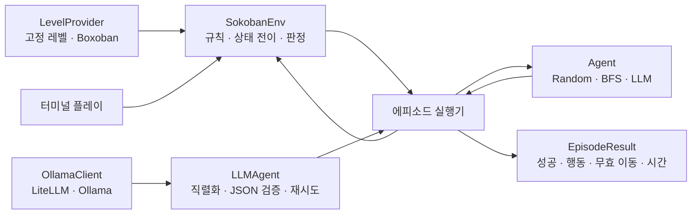

# 아키텍처

이 프로젝트는 Gymnasium 환경을 게임 규칙의 단일 기준으로 사용한다.
터미널 사용자와 향후 모든 에이전트는 같은 `reset()`과 `step()` 계약을
통해 보드를 조작한다.

## 최소 실행 구조

## 구현된 경계

- `LevelProvider`는 같은 크기의 레벨을 ID 또는 seed 기반 표본으로 공급한다.
- `SokobanEnv`만 플레이어와 상자 위치를 변경한다. 외부 코드는 항상
  `step()`으로 행동을 실행한다.
- 승리와 정적 코너 데드락은 `terminated`, 행동 제한 도달은 `truncated`로
  구분한다.
- 터미널 플레이는 환경을 조작하는 UI일 뿐 별도 게임 규칙을 갖지 않는다.
- `OllamaClient`는 모델 호출을, `LLMAgent`는 보드 프롬프트와 행동 검증,
  제한된 재시도를 담당한다.
- Random과 BFS는 같은 `Agent` Protocol을 구현한다.
- 실행기는 모든 Agent를 같은 레벨·seed 조합에서 실행하고 `EpisodeResult`를
  기록한다. 진단을 제공하는 Agent는 LLM 호출·재시도·오류·응답 시간도
  함께 기록한다.
- trace 실행기는 같은 에피소드 루프의 step observer를 통해 초기 보드와
  실행 후 보드를 저장한다. 노트북 애니메이션은 별도 재실행이 아니라 집계에
  사용된 `EpisodeResult`와 짝지어진 이 trajectory를 재생한다.

## 기준선 구조

기준선은 세 가지 계약으로 구성한다.

1. `Agent`: 초기 관찰로 에피소드를 준비하고 다음 행동을 반환한다.
2. 에피소드 실행기: reset, Agent 호출, step, 종료와 행동 제한을 관리한다.
3. `EpisodeResult`: 성공, 행동 수, 무효 이동, 데드락과 시간을 기록한다.

BFS, LLM 행동 검증기와 환경은 이동·밀기·정적 코너 데드락의 순수 규칙
함수를 공유한다.
상태 분석기, Planner, Controller 같은 세부 계층은 실제 구현 사이에 서로
다른 책임이 확인될 때만 추가한다. 우선순위는 [TODO](../TODO.md)에서
관리한다.
