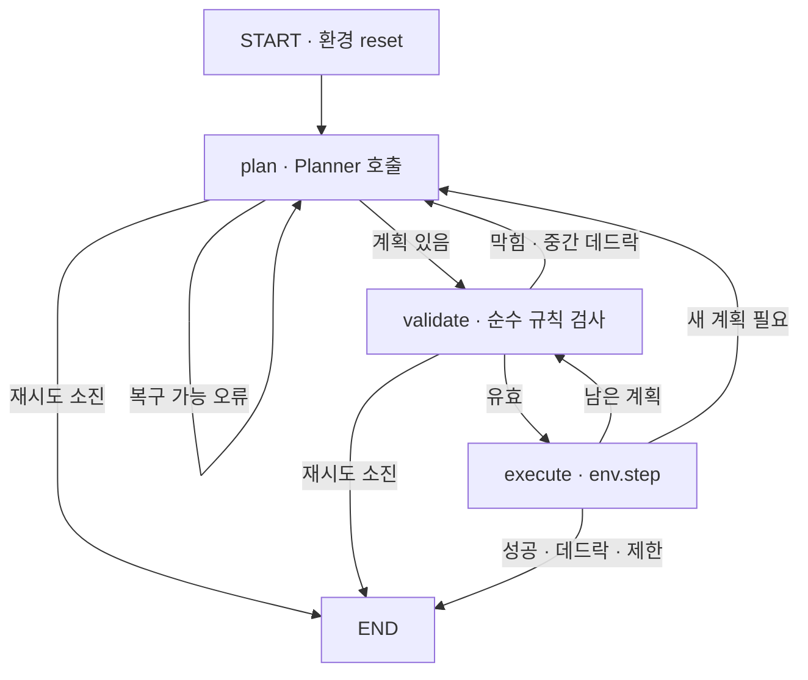

# LangGraph 중심 아키텍처

이 프로젝트의 실행 코어는 LangGraph다. Gymnasium 환경은 게임 규칙과 상태
전이의 단일 기준이고, Planner는 상태를 직접 변경하지 않은 채 행동 계획만
제안한다.

## 실행 그래프

`SokobanGraphState`에는 관찰, 환경 정보, 남은 계획, 행동 이력, 거절 피드백,
계획 시도 횟수와 평가 지표가 들어간다. `InMemorySaver`는 에피소드
`thread_id`별로 각 노드 이후 상태를 체크포인트한다.

## Planner 경계

모든 계획 방식은 같은 `Planner` Protocol을 구현한다.

- `RandomPlanner`: 한 행동을 표본 추출한다.
- `BFSPlanner`: 현재 상태에서 완전한 최단 행동열을 계산한다.
- `AStarPlanner`: 플레이어 이동 가능 영역을 계산하고 상자 밀기 단위로
  탐색한다. 상자-목표 최소 매칭과 정적 dead square를 휴리스틱으로 사용한다.
- `LLMPlanner`: JSON Schema로 1~8개의 짧은 행동 계획을 제안한다.
- `SearchGuardPlanner`: 주 Planner의 전체 제안을 규칙으로 적용한 뒤 BFS
  또는 A*로 후속 해답을 확인한다. 찾은 경로는 버리지 않고 제안 뒤에
  연결하며 같은 보드의 탐색 결과는 에피소드 동안 캐시한다.

그래프는 Planner 종류를 알 필요가 없다. 알고리즘 Planner가 여러 행동을
반환하면 그래프가 전체 계획의 막힌 이동과 중간 데드락을 먼저 검사하고
순서대로 실행한다. LLM의 형식 오류나 거절된 계획은 상태의 feedback에
기록되고 `plan` 노드로 되돌아간다.

## 책임 경계

- `env/`: 레벨, 규칙, 상태 전이, 성공과 데드락 판정
- `planning/`: BFS·A*·Random·LLM 계획 생성과 native Ollama 연결
- `graph/`: 계획, 검증, 실행, 재시도, 체크포인트
- `evaluation/`: 동일한 그래프를 사용한 벤치마크, 집계, trajectory

평가 실행기는 별도 행동 루프를 구현하지 않는다. 반드시 `SokobanGraph`를
호출하므로 기준선과 LLM이 같은 검증·복구 정책을 통과한다.

## 측정

에피소드 결과는 전체·계획·LLM·알고리즘 시간을 분리한다. Ollama의 모델
로딩, prompt eval, generation 시간과 입출력 토큰 수를 보존하고 탐색은
확장 상태 수와 순수 탐색 시간을 기록한다. 집계에는 평균뿐 아니라 p50,
p95와 출력 tokens/s가 포함된다.

## 다음 확장

장기 기억은 그래프 상태와 별도로 JSONL 또는 SQLite에 실패 상태를 저장한 뒤
`recall` 노드를 `plan` 앞에 추가한다. 더 큰 Boxoban에서는 freeze/tunnel
deadlock과 LLM의 상자-목표 하위 목표를 A* 탐색 순서에 결합한다.
