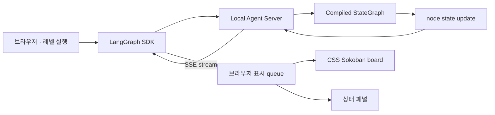

# LangGraph 실시간 Sokoban 관찰 화면 계획

## 목적

에이전트가 Sokoban을 모두 푼 뒤 trajectory를 재생하는 것이 아니라,
LangGraph가 실제로 계획하고 행동하는 동안 현재 보드와 의사결정 상태를
웹페이지에서 실시간으로 관찰한다.

화면은 별도 Sokoban 시뮬레이터가 아니다. Agent Server가 보내는 실제
LangGraph state update를 유일한 표시 기준으로 사용한다. 따라서 웹에 보이는
`#`, `@`, `$`, `.`, `*`의 위치는 항상 에이전트가 실행한 환경 상태와 같다.

## 범위

첫 버전은 다음 기능을 제공한다.

- 실행할 레벨, seed와 행동 제한 입력
- LangGraph run 시작과 실시간 연결 상태 표시
- 현재 Sokoban 보드를 CSS 타일로 렌더링
- 행동 단위의 플레이어·상자 이동 애니메이션
- 현재 graph node, 상태, 행동과 행동 수 표시
- 전략 가설, 하위 목표, 보호 제약과 위험 표시
- 예상 효과와 실제 결과, 계획 수정 이력 표시
- LLM과 국소 탐색 계측 표시
- 표시 일시정지, 한 단계 보기와 재생 속도 조절
- 성공, 데드락, 행동 제한과 오류 종료 표시

레벨 편집, 수동 플레이, 사후 trajectory 탐색과 원격 다중 사용자 운영은 첫
버전의 범위가 아니다.

## 핵심 원칙

### 실제 실행 state만 렌더링한다

웹은 이동 규칙, 충돌, push 또는 성공 여부를 다시 계산하지 않는다.
`execute_action` 또는 목표 그래프의 `execute_until_push`가 반환한 `board`,
`observation`, `action`과 상태를 그대로 표시한다.

### Agent Server stream을 직접 사용한다

별도 event broker나 자체 실행 protocol을 만들지 않는다. LangGraph SDK로
thread와 run을 만들고 Agent Server의 streaming run을 구독한다. 연결이
끊겼을 때는 지원되는 event ID와 thread 상태를 이용해 이어받는다.

### 시각화 속도와 정책 시간을 분리한다

graph node 안에 화면용 `sleep`을 넣지 않는다. Agent Server event는 즉시
받고 브라우저의 표시 queue에서 사람이 볼 수 있는 간격으로 재생한다.

- 실제 정책 시간: graph가 계산하고 실행한 시간
- 전송 시간: Agent Server에서 브라우저까지 event가 도착한 시간
- 표시 시간: CSS transition과 사용자 재생 속도

연구 결과의 `policy_elapsed_seconds`에는 표시 시간을 포함하지 않는다.

### 비밀과 숨은 추론을 표시하지 않는다

API key, 전체 prompt, 모델의 숨은 추론 원문과 내부 오류 상세는 웹 event에
포함하지 않는다. 구조화된 가설, 검증 가능한 짧은 근거, prompt 이름·commit,
모델과 계측만 표시한다.

## 실시간 데이터 흐름



브라우저는 Agent Server가 관리하는 thread와 run을 사용한다. 별도 Python
행동 루프나 게임 복제 서버를 추가하지 않는다. 인증 또는 브라우저 보안상
직접 연결이 불가능한 배포에서만 얇은 stream proxy를 둔다.

## event 계약

LangGraph state 전체를 UI 계약으로 노출하지 않는다. 브라우저가 필요한
필드만 안정적인 view event로 투영한다.

```json
{
  "event_id": "opaque-event-id",
  "thread_id": "opaque-thread-id",
  "node": "execute_until_push",
  "phase": "executing",
  "step": 4,
  "board": "#####\n# . #\n# $ #\n# @ #\n#####",
  "action": "UP",
  "action_count": 4,
  "max_steps": 20,
  "status": "행동 실행",
  "success": false,
  "deadlock": false,
  "truncated": false,
  "strategy": {
    "hypothesis": "B1을 T1에 먼저 배치한다",
    "assignment": "B1 → T1",
    "subgoal": "B1 아래의 지지 칸으로 이동한다",
    "protected_cells": ["2,3", "2,4"],
    "risk": "왼쪽 구석으로 밀지 않는다"
  },
  "effect": {
    "expected": "플레이어가 B1 아래에 도착한다",
    "observed": "예상 효과 충족"
  },
  "metrics": {
    "llm_calls": 1,
    "llm_prompt_tokens": 384,
    "llm_output_tokens": 96,
    "local_search_calls": 1,
    "local_expanded_states": 12
  }
}
```

원시 state에 새 필드가 추가되어도 이 event의 기존 필드를 바꾸지 않는다.
아직 구조화된 전략이 없는 baseline graph에서는 해당 필드를 `null` 또는
빈 목록으로 보낸다.

## 화면 구성

### 데스크톱

```text
┌─────────────────────────────┬──────────────────────────────┐
│ Sokoban                     │ 실행 상태                    │
│                             │ node       execute_action    │
│   ┌──┬──┬──┬──┬──┐         │ status     실행 중           │
│   │##│##│##│##│##│         │ action     UP                │
│   │##│  │◎ │  │##│         │ step       4 / 20            │
│   │##│  │□ │  │##│         ├──────────────────────────────┤
│   │##│  │● │  │##│         │ 전략                         │
│   │##│##│##│##│##│         │ hypothesis B1을 T1에 배치    │
│   └──┴──┴──┴──┴──┘         │ subgoal   B1 아래로 이동     │
│                             │ protected (2,3), (2,4)       │
│   ● connected  ▶  ⏸  1×    │ risk      왼쪽 구석 회피     │
│                             ├──────────────────────────────┤
│                             │ 예상 효과 / 실제 결과        │
└─────────────────────────────┴──────────────────────────────┘
```

왼쪽은 보드를 우선하고 오른쪽은 현재 판단을 우선한다. 작은 화면에서는
상태 패널을 보드 아래로 이동한다.

### 오른쪽 상태 패널

패널은 다음 순서로 구성한다.

1. 연결과 실행 상태
2. 현재 LangGraph node
3. 현재 행동, 행동 수와 push 수
4. 전략 가설과 상자-목표 배정
5. 현재 하위 목표
6. 보호 제약과 위험
7. 예상 효과와 실제 결과
8. 최근 계획 수정
9. LLM·국소 탐색 계측

한 화면에 전체 decision history를 펼치지 않는다. 현재 상태를 먼저 보여주고,
이전 event는 접을 수 있는 timeline으로 제공한다.

## CSS 보드 표현

이미지 asset 없이 semantic HTML과 CSS로 시작한다.

| 기호 | 의미 | CSS 표현 |
| --- | --- | --- |
| `#` | 벽 | 어두운 벽돌색 타일과 안쪽 테두리 |
| ` ` | 바닥 | 낮은 대비의 격자 바닥 |
| `.` | 목표 | 중앙의 원형 ring과 약한 glow |
| `$` | 상자 | 갈색 사각형, 테두리와 십자 홈 |
| `@` | 플레이어 | 둥근 머리·몸 형태와 진행 방향 표시 |
| `*` | 목표 위 상자 | 상자에 성공색 테두리와 목표 glow |
| `+` | 목표 위 플레이어 | 플레이어 아래 목표 ring |

보드는 CSS Grid로 구성하고 각 칸은 동일한 정사각형 비율을 유지한다.
플레이어와 상자 layer에는 `transform` transition을 적용한다. 사용자가
`prefers-reduced-motion`을 설정한 경우 transition을 제거한다.

첫 버전의 시각적 목표는 게임 아트 재현이 아니라 다음을 즉시 구분하는
것이다.

- 벽과 이동 가능 공간
- 플레이어와 상자
- 비어 있는 목표와 완료된 목표
- 방금 움직인 대상
- 보호해야 하는 칸과 위험 칸

보호 칸은 파란 outline, 위험 칸은 붉은 점선 overlay로 선택적으로 표시한다.

## 표시 queue와 애니메이션

Agent Server event 수신과 화면 재생을 분리한다.

```text
stream 수신 → event 정규화 → queue 저장 → 현재 속도로 한 event씩 표시
```

- 기본 행동 간격: 350ms
- 선택 속도: 0.5×, 1×, 2×, 즉시
- 일시정지: UI queue만 멈추고 graph run은 계속 실행
- 한 단계: queue에서 event 하나만 소비
- 따라잡기: 대기 event가 많으면 사용자가 최신 상태로 즉시 이동

첫 버전의 일시정지는 관찰 화면만 멈춘다. 실제 에이전트 실행을 멈추는
기능은 LangGraph interrupt를 사용하는 별도 기능으로 다룬다.

## 실행 상태

UI는 최소한 다음 상태를 명확히 구분한다.

- `connecting`: Agent Server 연결 중
- `planning`: prompt 구성 또는 모델 응답 대기
- `validating`: 전략·행동 검증 중
- `executing`: 행동 또는 push 실행
- `reflecting`: 예상 효과 비교와 계획 수정
- `success`: 퍼즐 해결
- `deadlock`: 데드락 종료
- `truncated`: 행동 제한 도달
- `error`: 복구하지 못한 실행 오류
- `disconnected`: stream 연결 끊김

모델 응답을 기다리는 동안 보드가 멈춘 것처럼 보이지 않도록 현재 node와
경과 시간을 계속 표시한다.

## 구현 단계

### 1. stream spike

- local Agent Server에서 하나의 thread와 streaming run을 시작한다.
- node update에서 `board`, `action`, `status`를 브라우저 콘솔에 출력한다.
- `tiny-walk`의 모든 행동 update가 순서대로 도착하는지 확인한다.

완료 조건: run이 끝나기 전에 첫 `execute_action` state가 브라우저에
도착하고, 최종 board가 graph의 최종 state와 같다.

### 2. CSS 보드 MVP

- multiline `board`를 타일 배열로 변환한다.
- CSS Grid와 semantic tile class로 모든 기호를 표현한다.
- 연결, planning, executing과 최종 상태를 표시한다.
- 350ms 표시 queue와 속도·일시정지·한 단계 controls를 추가한다.

완료 조건: `tiny-walk`를 실행하면서 `@`, `$`, `*`의 변화를 새로고침 없이
확인하고 reduced-motion 설정에서도 정보를 잃지 않는다.

### 3. 상태 패널

- graph node와 실행 계측을 표시한다.
- 구조화된 가설, 배정, 하위 목표, 보호 제약과 위험을 표시한다.
- 예상 효과, 실제 결과와 최근 `PlanRevision`을 표시한다.
- baseline graph의 누락 필드를 안전하게 처리한다.

완료 조건: 보드의 각 행동과 오른쪽 상태가 같은 event ID를 가리키며,
이전 state가 현재 판단으로 잘못 표시되지 않는다.

### 4. 연결 복구와 검증

- stream disconnect와 reconnect 상태를 표시한다.
- 지원되는 event ID 또는 thread state로 최신 상태를 복구한다.
- 빠른 event, 느린 LLM 응답, 오류 종료와 빈 전략 상태를 시험한다.
- 모바일 레이아웃과 키보드 조작을 검증한다.

완료 조건: 연결이 한 번 끊겨도 중복 행동 없이 최신 board로 복구하고,
성공·데드락·제한·오류 종료를 모두 구분한다.

## 테스트

- board 기호별 CSS tile 변환
- board 행 길이 불일치와 알 수 없는 기호 거절
- event 순서와 중복 event ID 처리
- 표시 queue의 pause, step, speed와 catch-up
- baseline·구조화 graph event 정규화
- 상태 패널과 board의 event ID 일치
- stream disconnect와 reconnect
- 성공·데드락·truncated·error 상태
- 반응형 배치와 reduced-motion

실제 Agent Server를 사용하는 통합 테스트에서는 `tiny-push`와 `tiny-walk`를
실행해 첫 event가 run 종료 전에 도착하는지 확인한다.

## 완료 기준

1. 사용자가 웹에서 레벨을 시작하고 실행 중인 board를 실시간으로 본다.
2. `@`, `$`, `*`의 위치가 행동마다 CSS transition으로 갱신된다.
3. 오른쪽 패널이 같은 event의 node, 행동, 전략과 결과를 표시한다.
4. 웹은 게임 규칙이나 다음 상태를 자체 계산하지 않는다.
5. 시각화 지연이 에이전트 정책 시간과 평가 지표에 포함되지 않는다.
6. CLI·평가·Studio와 같은 compiled graph 및 Agent Server run을 사용한다.
7. 성공·데드락·행동 제한·오류와 연결 끊김을 구분한다.

## 기술 참고

- [LangGraph streaming](https://docs.langchain.com/langsmith/streaming)
- [Agent Server](https://docs.langchain.com/langsmith/agent-server)
- [Agent Server API](https://docs.langchain.com/langsmith/server-api-ref)
